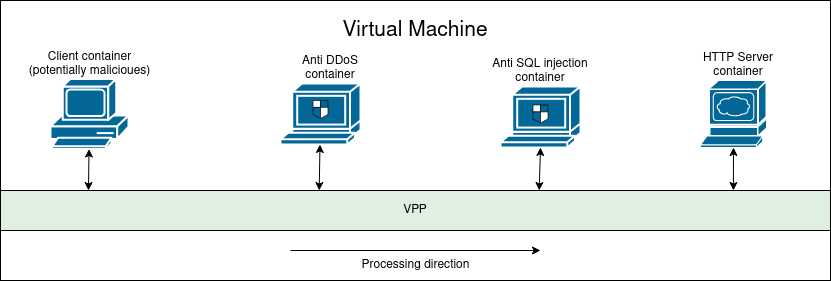

# TiP-project-VPP

## Opis

Celem projektu jest zapoznanie się z technologią VPP. Składają się na to następujące elementy:
- Stworzenie referatu obrazującego zastosowanie VPP w technologiach telekomunikacyjnych
- Utworzenie Proof of Concept z zainstalowanym VPP
- Utworzenie Proof of Concept z zainstalowanym VPP w środowisku z kontenerami

## Link do referatu

https://www.overleaf.com/project/6458ec6edbbbbb551fe21368

# Proof of Concept

## Opis
Proof of concept (Przykładowa aplikacja) składa się z czterech kontenerów, które symulują system telco przetwarzający duże ilości danych. Krótki opis stworzonych konenerów:
  1. klient (potencjalnie szkodliwy)
  2. wykrywacz ataków typu DDoS
  3. wykrywacz ataków typu SQL injection
  4. serwer HTTP

### Połączenie
Kontenery są połączone w łańcuch poprzez sieć VPP w kolejności 1-4 (zobacz diagram niżej), a ruch przkazują dalej poprzez serwer nginx zainstalowany na kontenerach 2 i 3. Jeden z kontenerów symuluje zachowanie klienta, trzy pozostałe przetwarzają dane od niego pochodzące. Klient może potencjalnie chcieć zaatakować infrastrukturę telco, dlatego zadaniem dwóch kontenerów na infrastrukturze jest wykryć atak i zablokować ruch od atakującego klienta, zanim po łańcuchu dotrze do serwera HTTP. 

### Wykrywanie ataków
Dla każdego z dwóch kontenerów wykrywających atak, zostały użyte różne techniki jego wykrywania:
  - kontener 2 (any DDoS) - posiada zainstalowany program stworzony przez Cisco, [snort](https://www.snort.org/), z regułami odpowiednio ustawionymi pod wykrywanie ataków DDoS
  - kontener 3 (anty SQL injection) - ten atak jest prostszy do wykrycia, wystarczy w serwerze nginx ustawić regułą wykrywającą dopoasowanie do ciągu znaków odpowiadającemu typowemu atakowi typu SQL injection

### Diagram


## Instalacja VPP

Ruch sieciowy w przykładowej aplikacji odbywa się poprzez VPP zainstalowane na hoście, na którym działają kontenery. W celu przetestowania aplikacji, należy go najpierw zainstalować.

```
curl −s https://packagecloud.io/install/repositories/fdio/release/script.deb.sh | sudo bash
sudo apt-get update
sudo apt−get install vpp vpp−plugin−core vpp−plugin−dpdk
```

Do uruchomienia przykładowej aplikacji, wymagane jest posiadanie zainstalowanego dockera

## Instalacja

```
git clone git@github.com:ChrisGadek1/TiP-project-VPP.git
cd TiP-project-VPP/poc/vpp/src/
```
## Uruchomienie

Klient może działać w trzech różnych trybach, który użytkownik POC wybiera ustawiając zmienną `CLIENT_OPTION` w postaci numerka 1, 2 lub 3. Dostępne są następujące opcje:
  - Opcja "1": klient spróbuje przeprowadzić atak typu DDoS.
  - Opcja "2": klient spróbuje przeprowadzić atak typu SQL injection.
  - Opcja "3": klient wyśle nieszkodliwe zapytanie HTTP.

```
sudo make docker
sudo make start CLIENT_OPTION=wybrana opcja
```

Po przeprowadzonym eksperymencie, aby uruchomić go ponownie, należy usunąć istniejące już kontenery:
```
sudo make clean
```

## Zaobserwowane działanie

Aby podejrzeć działanie aplikacji, wystarczy sprawdzić dockerowe logi na kontenerze klienta

```
sudo docker logs client
```

Klient czeka około 20 sekund na zestawienie się całego systemu, po tym czasie wykonuje jedno z trzech zleconych mu zadań.
Efekty poszczególnych zadań są następujące:

  - Zadanie nr 1: próba przeprowadzenia ataku DDoS - Reguła snorta na kontenerze nr 2 wykrywająca atak typu DDoS ustawiona jest w taki sposób, że jeżeli wykryje ponad 10 połączeń od jednego klienta w ciągu sekundy, uzna to za atak i zablokuje mu możliwość stworzenia sesji TCP. W logach wygląda to następująco: pierwsze 10 pakietów zostaje przepuszczone do serwera HTTP, który zwraca odpowiedź:
  ```
  <html><body><h1>It works!</h1></body></html>
  ```
  Przy 11 i każdym następnym pakiecie, występuje błąd połączenia TCP po stronie klienta:
  ```
  ++ curl 'http://169.254.10.5/?arg=ddos'
  % Total    % Received % Xferd  Average Speed   Time    Time     Time  Current
                                 Dload  Upload   Total   Spent    Left  Speed
  0     0    0     0    0     0      0      0 --:--:-- --:--:-- --:--:--     0
  curl: (7) Failed to connect to 169.254.10.5 port 80: Connection refused
  ```
  - Zadanie nr 2: próba przeprowadzenia ataku SQL injection - W tym przypadku serwer nginx zainstalowany na kontenerze nr 3 dopasuje zapytanie GET do wzorca ataku typu SQL injection i zablokuje request do dalszego przetwarzania. W logach klienta zobaczymy następującą odpowiedź:
  ```
  <head><title>403 Forbidden</title></head>
  <body>
  <center><h1>403 Forbidden</h1></center>
  <hr><center>nginx/1.18.0 (Ubuntu)</center>
  </body>
  </html>
  ```
  - Zadanie nr 3: wysłanie niezłośliwego zapytania - w tym przypadku zapytanie dojdzie do serwera HTTP i klient otrzyma odpowiedź:
  ```
  <html><body><h1>It works!</h1></body></html>
  ```

Wszystkie zapytania wysyłane pomiędzy kontenerami są realizowane poprzez VPP, a jest to realizowane za pomocą specjalnych socketów generowanych na żądanie kontenerów przez VPP. Cały ruch sieciowy odbywa się poprzez te kontenery